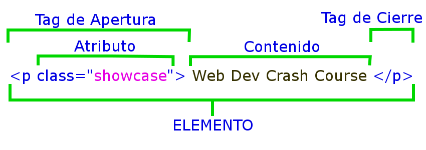

# Sesion 1

## Introduccion a HTML

HTML (HyperText Markup Language) es un lenguaje de marcado, usado para decirle a tu navegador cómo estructurar la páginas que visitas. HTML consiste en una serie de  elementos, que puedes utilizar para encerrar, envolver, o marcar partes diferentes del contenido para hacer que aparezcan de una cierta manera, o actúen de determinada forma. Las etiquetas que envuelven un trozo de contenido pueden hacer que dicho contenido enlace con otra página, ponga una palabra en cursiva, etcétera.


## Sintaxis




### Las partes principales de nuestro elemento son:

* **La etiqueta de apertura:** Esta consiste en el nombre del elemento (en este caso, p), encerrada en paréntesis angulares de apertura y cierre. Esto indica donde el elemento comienza, o empieza a tener efecto — en este caso donde comienza el párrafo.
* **La etiqueta de cierre:** Es lo mismo que la etiqueta de apertura, excepto que incluye una barra diagonal antes del nombre del elemento. Esto indica dónde termina el elemento— en este caso dónde finaliza el párrafo. No incluir una etiqueta de cierre es un error común de principiante, y puede conducir a resultados extraños.
* **El contenido:** Este es el contenido del elemento, que en este caso es sólo texto.
* **El elemento:** El elemento lo conforman la suma de la etiqueta de apertura, la etiqueta de cierre y  el contenido.


### Atributos

Los atributos contienen información extra sobre el elemento que no se mostrará en el contenido.

Un atributo debería tener:

1. Un espacio entre él y el nombre del elemento (o atributo previo, si el elemento ya tiene uno o más atributos.)
1. El nombre del atributo, seguido por un signo igual.
1. Un valor del atributo, con comillas de apertura y cierre alrededor de él.

En ocasiones puedes ver atributos escritos sin valores. Esto está permitido. Se denominan atributos booleanos y pueden tener únicamente un valor, que como norma general es el mismo que el nombre del atributo. 

Por ejemplo, el atributo disabled que se puede asignar a elementos de entrada de formularios si se desea desactivar para que el usuario no pueda introducir datos en él.

```html
<input type="text" disabled="disabled">
```

### Elementos Vacios

Algunos elementos consisten solo en una etiqueta única, que se utiliza generalmente para insertar/incrustar algo en el documento en el lugar donde es incluida. estos elemnentos son:

```html
<area>
<base>
<br>
<col>
<embed>
<hr>

<input>
<keygen>(HTML 5.2 Draft removed)
<link>
<meta>
<param>
<source>
<track>
<wbr>
```

### Elementos Anidados

También puedes poner elementos dentro de otros elementos — esto se llama **anidamiento**. Si quisiéramos decir que nuestro gato es MUY gruñón, podríamos encerrar la palabra "muy" en un elemento ```<strong>```, lo que significa que la palabra debe enfatizarse.

```html
<p>Mi gato es <strong>muy</strong> gruñón.</p>
```

### Tipos de Elementos

Hay dos categorías de elementos en HTML, que es importante que conozcas — elementos de bloque y elementos en línea.

* **Los elementos de bloque:** forman un bloque visible en la página — aparecerán en una nueva línea después de cualquier contenido anterior y cualquier contenido quebvaya después también aparecerá en una nueva línea. Los elementos de bloque tienden a ser elementos estructurales en la página que representan por ejemplo párrafos, listas, menús de navegación, pies de página, etc. Un elemento bloque no estaría anidado dentro de un elemento en línea, pero podría estar anidado dentro de otro elemento a nivel de bloque.
* **Los elementos en línea:** son aquellos que están contenidos dentro de elementos de bloque y rodean solo pequeñas partes del contenido del documento, no párrafos enteros ni agrupaciones de contenido. Un elemento en línea no hará que se genere una nueva línea aparezca en el documento y normalmente aparecen dentro de un párrafo o texto, por ejemplo es el caso de un elemento ```<a>```  (hipervículo) o elementos de énfasis como ```<em>``` o ```<strong>```.

```html
<em>primero</em><em>segundo</em><em>tercero</em>

<p>cuarto</p><p>quinto</p><p>sexto</p>
```

<em>primero</em><em>segundo</em><em>tercero</em>

<p>cuarto</p><p>quinto</p><p>sexto</p>


### Espacios en Blanco

No importa cuantos espacios en blanco se utilicen (se pueden incluir tanto caracteres de espacio como saltos de línea) el analizador de HTML reduce cada uno a un único espacio, al representar el código.
¿Entonces por qué utilizar espacios en blanco?  La respuesta es legibilidad: es mucho más fácil entender el código si está bien formateado en lugar de estar desordenado. 

Los dos siguientes fragmentos de código son equivalentes:

```html
<p>Dogs are silly.</p>

<p>Dogs        are
         silly.</p>
```

### Caracteres Especiales

En HTML, los carácteres **<, >, ", '** y **&** son caracteres especiales. Forman parte de la sintaxis HTML , pero ¿cómo se pueden incluir en el texto si realmente queremos hacer uso de un ampersand (&) o el signo menor que (<), y que el navegador no lo interprete como  código? 

Tenemos que utilizar caracteres de referencia ─ códigos especiales que representan caracteres. Cada caracter de referencia comienza con un signo de ampersand (&) y finaliza con un punto y coma (;).

Carácter Literal | Equivalente de referencia de Carácteres
-----------------|----------------------------------------
```<```	|	```&lt;```
```>``` |	```&gt;```
```"```	|   ```&quot;```
```'```	|   ```&apos;```
```&```	|   ```&amp;```

### Comentarios

En HTML, existen mecanismos para escribir comentarios en el código. Los comentarios son ignorados por el navegador y son invisibles para el usuario. Su propósito es permitir comentar el código para aclarar su funcionamiento, explicar lo que hacen las diferentes partes del código

Para convertir una sección de contenido dentro de su archivo HTML en un comentario, debe envolverlo en los marcadores especiales ```<!--``` y ```-->```, por ejemplo:

```html
<p>Esto es un contenido</p>

<!-- <p>esto es un comentario</p> -->


```